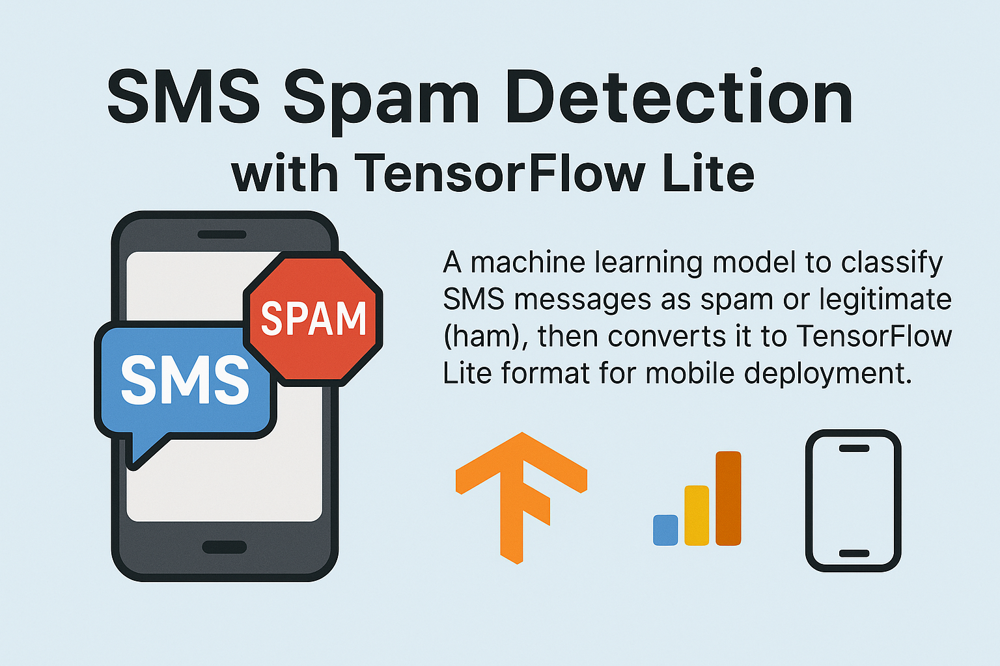

# SMS Spam Detection with TensorFlow Lite



A machine learning project that trains a deep learning model to classify SMS messages as spam or legitimate (ham), then converts it to TensorFlow Lite format for mobile deployment.

## 📋 Overview

This project implements a bidirectional LSTM-based neural network for SMS spam detection. The model is trained on the SMS Spam Collection Dataset and optimized for mobile deployment using TensorFlow Lite, achieving high accuracy while maintaining a small model size (< 1MB).

---
#### Open in Google Colab: [here](https://colab.research.google.com/drive/11dHo8YzzVmBlmZQoTazUWjdevwk6auS9?usp=sharing)
---

## 🎯 Features

- **Deep Learning Model**: Uses a Bidirectional LSTM architecture for sequence classification
- **Mobile-Optimized**: Converts to TensorFlow Lite format for mobile device deployment
- **High Accuracy**: Achieves ~98% validation accuracy on the test set
- **Small Model Size**: TFLite model is only 669KB, perfect for mobile apps
- **Text Preprocessing**: Includes tokenization and padding for text input
- **Easy Testing**: Includes example test cases to validate model performance

## 🏗️ Model Architecture

The model consists of:
- **Embedding Layer**: 10,000 vocabulary size with 16-dimensional embeddings
- **Bidirectional LSTM**: 16 units for sequence processing
- **Dense Layer**: 32 units with ReLU activation
- **Output Layer**: Single unit with sigmoid activation for binary classification

## 📊 Dataset

The model is trained on the **SMS Spam Collection Dataset**:
- **Source**: [Kaggle SMS Spam Collection Dataset](https://www.kaggle.com/datasets/uciml/sms-spam-collection-dataset)
- **Encoding**: Latin-1
- **Classes**: 
  - Ham (legitimate): 4,827 messages
  - Spam: 747 messages
- **Class Distribution**: ~6:1 ratio of ham to spam messages

## 🚀 Quick Start

### Prerequisites

```bash
pip install tensorflow pandas numpy scikit-learn
```

### Running the Model

1. **Clone the repository**:
   ```bash
   git clone <repository-url>
   cd sms-spam-tflite-model
   ```

2. **Open the Jupyter notebook**:
   ```bash
   jupyter notebook tflite_sms_spam_model.ipynb
   ```

3. **Run all cells** to:
   - Load and preprocess the dataset
   - Train the model
   - Test with example messages
   - Convert to TensorFlow Lite format

## 📁 Project Structure

```
sms-spam-tflite-model/
├── tflite_sms_spam_model.ipynb    # Main training notebook
├── data/
│   └── spam.csv                   # SMS dataset
├── assets/                        # Additional assets (for README)
└── README.md                      # This file
```

## 🔧 Model Training Process

1. **Data Preprocessing**:
   - Load CSV file and clean column names
   - Convert text labels to binary (0=ham, 1=spam)
   - Tokenize text with 10,000 word vocabulary
   - Pad sequences to 100 tokens

2. **Model Training**:
   - Train for up to 15 epochs with early stopping
   - Use 80/20 train/validation split
   - Binary crossentropy loss with Adam optimizer

3. **Model Conversion**:
   - Save as Keras model (2.0MB)
   - Convert to TensorFlow Lite format (669KB)

## 🧪 Testing Examples

The model correctly identifies spam messages like:
- "Winner! Free money! click here: asfdlk2j3.adkalfkj2a.cm.com/winner/activation" → **SPAM**
- "Make $100/hr no ID verification reply with 'Cash' to 54135" → **SPAM**

And legitimate messages like:
- "Hey man, don't forget to bring cash to the show!" → **HAM**
- "Where's the lottery ticket? I want to see if we are winners!" → **HAM**

## 📱 Mobile Deployment

The TensorFlow Lite model (`spam_classifier.tflite`) is ready for mobile deployment:

- **Model Size**: 669KB
- **Input Shape**: (None, 100) - padded token sequences
- **Output**: Single probability value (0-1)
- **Threshold**: 0.5 for spam classification

### Integration Example

```python
import tensorflow as tf
import numpy as np

# Load TFLite model
interpreter = tf.lite.Interpreter(model_path="spam_classifier.tflite")
interpreter.allocate_tensors()

# Get input/output details
input_details = interpreter.get_input_details()
output_details = interpreter.get_output_details()

# Preprocess text (tokenize and pad)
# ... preprocessing code ...

# Run inference
interpreter.set_tensor(input_details[0]['index'], input_data)
interpreter.invoke()
prediction = interpreter.get_tensor(output_details[0]['index'])

# Classify
is_spam = prediction[0] > 0.5
```

## 📈 Performance

- **Training Accuracy**: ~100%
- **Validation Accuracy**: ~98%
- **Model Size**: 669KB (TFLite)
- **Inference Speed**: Optimized for mobile devices

## 📄 License

This project is open source and available under the [MIT License](LICENSE).

## 🙏 Acknowledgments

- [SMS Spam Collection Dataset](https://www.kaggle.com/datasets/uciml/sms-spam-collection-dataset) by UCI Machine Learning Repository
- TensorFlow and TensorFlow Lite for model optimization
- The machine learning community for best practices and techniques
